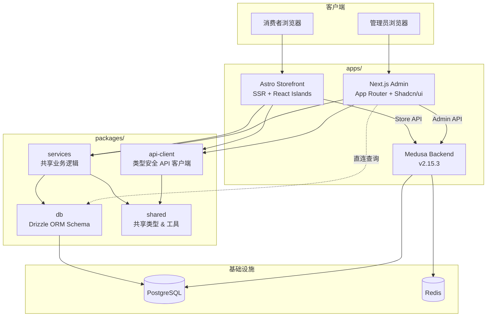
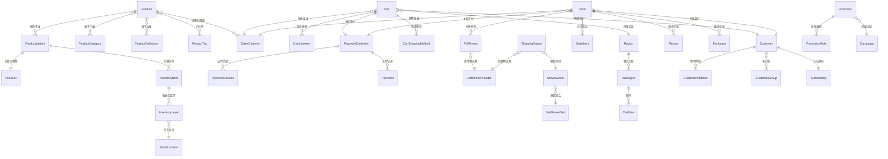
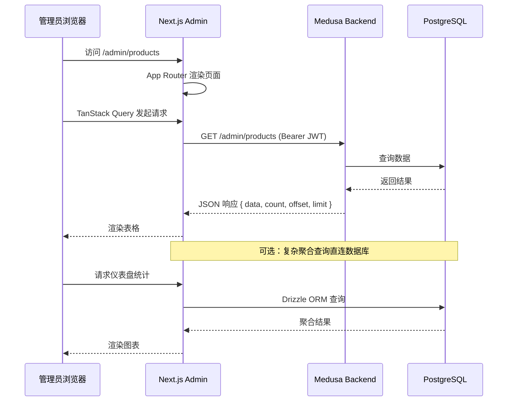
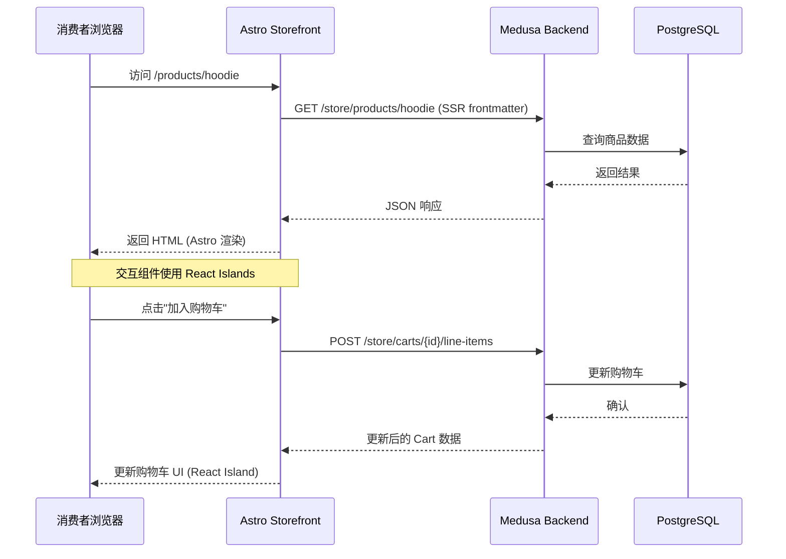
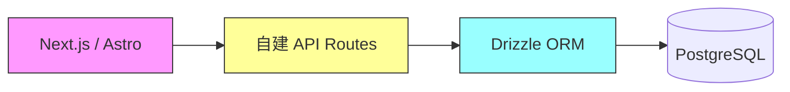
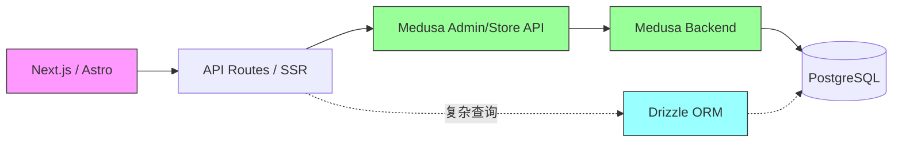
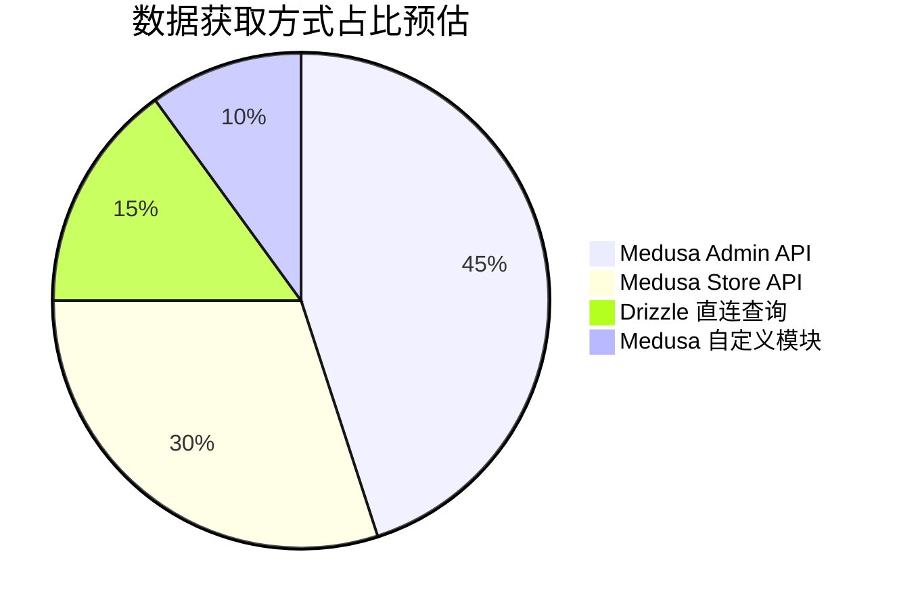

# 项目架构总览

> **注意（2026）**：下文部分仍描述「Next.js Admin + 不修改 Medusa 后端」。当前定案以 **[00-agent-handoff.md](00-agent-handoff.md)** 与 **[07-feature-spec.mdx](07-feature-spec.mdx)** 为准：**Hono 自建 API + Vite Admin + Astro store-web**。

## 1. 项目背景

- 基于 **Medusa v2.15.3** 的跨境电商平台
- 重新构建前端（Admin + Storefront），复用 Medusa 后端 API 和数据库
- 技术栈：**Next.js**（Admin）、**Astro**（Storefront）、**Drizzle ORM**、**pnpm + Turborepo**

本项目的核心思路是：保留 Medusa 强大的后端引擎（模块系统、工作流、事件总线），但用现代前端框架完全替换其自带的 Admin Dashboard 和 Storefront，以获得更好的开发体验和更灵活的定制能力。

---

## 2. 目标架构

### 2.1 Monorepo 结构

```
my-ecommerce/
├── apps/
│   ├── admin/          # Next.js 15 + Shadcn/ui + TanStack Table/Query
│   ├── storefront/     # Astro 5 + React Islands + Tailwind
│   └── backend/        # Medusa v2 后端 (保持不变)
├── packages/
│   ├── db/             # Drizzle ORM schema (映射 Medusa 表)
│   ├── services/       # 共享业务逻辑 (参考 Medusa 重写)
│   ├── api-client/     # 类型安全的 API 客户端
│   └── shared/         # 共享类型、工具函数
├── docs/               # 蓝图文档
├── AGENTS.md           # AI 开发指令
└── turbo.json          # Turborepo 配置
```

### 2.2 架构总览图



---

## 3. Medusa 模块清单

Medusa v2 采用模块化架构，以下是所有 20 个业务模块的详细清单：

| # | 模块名称 | 表数量 | 核心实体 | Admin 页面 | Store 页面 |
|---|---------|--------|---------|-----------|-----------|
| 1 | **Product** | 9 | Product, ProductVariant, ProductOption, ProductType, ProductCategory, ProductTag, ProductCollection | 商品列表、商品详情编辑、变体管理、分类管理、合集管理 | 商品列表、商品详情、分类浏览 |
| 2 | **Pricing** | 6 | PriceSet, Price, PriceList, PriceRule, PricePreference | 价格列表管理、价格规则配置 | 商品价格展示 |
| 3 | **Order** | 12 | Order, OrderItem, OrderChange, OrderShippingMethod, Return, Exchange, Claim, OrderTransaction | 订单列表、订单详情、退货/换货处理 | 订单历史、订单跟踪 |
| 4 | **Cart** | 5 | Cart, CartLineItem, CartAddress, CartShippingMethod | — | 购物车、结账流程 |
| 5 | **Customer** | 3 | Customer, CustomerGroup, CustomerAddress | 客户列表、客户详情、客户组管理 | 个人中心、地址管理 |
| 6 | **Auth** | 2 | AuthIdentity, ProviderIdentity | — | 登录、注册 |
| 7 | **Inventory** | 3 | InventoryItem, InventoryLevel, ReservationItem | 库存管理、库存水平调整 | 库存状态展示 |
| 8 | **Stock Location** | 2 | StockLocation, StockLocationAddress | 仓库管理 | — |
| 9 | **Sales Channel** | 1 | SalesChannel | 销售渠道管理 | — |
| 10 | **Fulfillment** | 7 | Fulfillment, FulfillmentSet, FulfillmentProvider, ServiceZone, ShippingOption, ShippingProfile, GeoZone | 发货管理、物流配置、运费模板 | 物流选择、物流跟踪 |
| 11 | **Payment** | 4 | PaymentCollection, Payment, PaymentSession, PaymentProvider | 支付记录查看、退款处理 | 支付流程 |
| 12 | **Promotion** | 5 | Promotion, PromotionRule, Campaign, CampaignBudget, ApplicationMethod | 促销活动管理、优惠券管理 | 优惠码输入 |
| 13 | **Tax** | 4 | TaxRegion, TaxRate, TaxRateRule, TaxProvider | 税率配置 | 税费计算展示 |
| 14 | **Currency** | 1 | Currency | 货币管理 | 货币切换 |
| 15 | **Region** | 1 | Region | 区域管理 | 区域选择 |
| 16 | **Store** | 1 | Store | 店铺设置 | — |
| 17 | **API Key** | 1 | ApiKey | API 密钥管理 | — |
| 18 | **User** | 2 | User, Invite | 用户管理、邀请管理 | — |
| 19 | **Notification** | 2 | Notification, NotificationProvider | 通知记录查看、通知配置 | — |
| 20 | **File** | 1 | File | 文件管理 | — |

> **总计**：约 72 张核心表（不含 Link 关联表和内部元数据表）

---

## 4. 模块间关系



---

## 5. 数据流

### 5.1 Admin 数据流



### 5.2 Store 数据流



### 5.3 认证流程

| 角色 | 认证方式 | Token 类型 | 存储位置 | 过期时间 |
|------|---------|-----------|---------|---------|
| Admin 用户 | 邮箱 + 密码 | JWT (Bearer) | httpOnly Cookie / localStorage | 7 天 |
| Store 顾客 | 邮箱 + 密码 / 社交登录 | JWT (Bearer) | httpOnly Cookie | 30 天 |
| 匿名顾客 | — | Session Token | Cookie | 无过期 |

认证流程：

1. **Admin 登录**：`POST /auth/user/emailpass` → 获取 JWT → 后续请求携带 `Authorization: Bearer <token>`
2. **顾客登录**：`POST /auth/customer/emailpass` → 获取 JWT → 后续请求携带 `Authorization: Bearer <token>`
3. **匿名购物**：首次访问时创建 Cart，通过 Cart ID 跟踪会话；注册/登录后将匿名 Cart 关联到客户

---

## 6. 开发模式选择

### 方案 A：完全重写



**做法**：完全不启动 Medusa Backend，自行用 Drizzle ORM 操作数据库。

**优点**：
- 完全掌控数据层，无中间依赖
- 可以设计更适合业务的 API 结构
- 减少一个运行时进程

**缺点**：
- 需要重新实现 Medusa 的所有业务逻辑（支付流程、库存扣减、订单状态机等）
- 丢失 Medusa 的工作流引擎、事件系统、插件生态
- 开发量巨大，容易遗漏边界情况
- 数据库迁移需要自行管理

### 方案 B：API 代理模式（推荐）



**做法**：保持 Medusa Backend 运行，Next.js/Astro 通过其 REST API 进行操作。仅在需要复杂查询或聚合时，通过 Drizzle ORM 直连数据库。

**优点**：
- 复用 Medusa 的全部业务逻辑（支付、库存、订单等）
- 保留工作流引擎和事件系统
- 可通过 Medusa 自定义模块扩展后端功能
- 开发量小，可以逐步推进

**缺点**：
- 多一个后端进程需要部署和维护
- 部分操作需要多次 API 调用
- 受限于 Medusa API 的设计

### 推荐策略

**采用方案 B（API 代理模式）**，并结合以下策略：

1. **默认使用 Medusa API**：所有标准 CRUD 操作通过 Medusa Admin/Store API 完成
2. **Drizzle 直连用于只读查询**：仪表盘统计、复杂报表、搜索聚合等场景直连数据库
3. **Medusa 自定义模块用于扩展**：需要新增后端逻辑时，通过 Medusa Module 方式扩展而非绕过
4. **逐步迁移**：未来如果需要，可以逐模块将 Medusa API 替换为自建 API


