# Medusa v2.15.3 数据库 Schema 参考

> ⚠️ **参考文档**（Medusa 官方表结构对照）。**项目完成度** → [PROJECT_STATUS.md](./PROJECT_STATUS.md)

> 本文档从 `@medusajs/*` 包的 DML (Data Modeling Language) 定义中提取，覆盖全部 20 个模块、102 个模型。
> 用于新项目（Drizzle ORM）的 schema 映射参考。

## DML 类型 → PostgreSQL / Drizzle 映射

| DML 类型 | PostgreSQL 类型 | Drizzle 类型 |
|----------|----------------|-------------|
| `model.id({ prefix })` | `text` (如 `prod_xxx`) | `text("id")` |
| `model.text()` | `text` | `text()` |
| `model.number()` | `integer` | `integer()` |
| `model.float()` | `real` | `real()` |
| `model.bigNumber()` | `numeric` + `jsonb` (raw) | `numeric()` + `jsonb("raw_xxx")` |
| `model.boolean()` | `boolean` | `boolean()` |
| `model.json()` | `jsonb` | `jsonb()` |
| `model.dateTime()` | `timestamptz` | `timestamp({ withTimezone: true })` |
| `model.enum(...)` | `text` (存字符串值) | `text()` |
| `model.autoincrement()` | `serial` | `serial()` |
| `model.array()` | `jsonb` (数组) | `jsonb()` |

> **bigNumber 特殊说明**: Medusa 对金额类字段使用 `bigNumber`，实际存储为两列：
> - `amount` (numeric) — 格式化后的数值
> - `raw_amount` (jsonb) — 原始精度数据 `{ value: "1000", precision: 2 }`

> **所有表都有**: `created_at` (timestamptz), `updated_at` (timestamptz), `deleted_at` (timestamptz, nullable) — 软删除

---

## 1. Product 模块 (10 表)

### product
商品主表。

| 列名 | 类型 | 约束 | 说明 |
|------|------|------|------|
| id | text | PK, prefix: `prod` | |
| title | text | NOT NULL | 商品标题 |
| handle | text | UNIQUE (where deleted_at IS NULL) | URL 标识 |
| subtitle | text | nullable | 副标题 |
| description | text | nullable | 描述 |
| is_giftcard | boolean | default: false | 是否礼品卡 |
| status | text | default: `draft` | `draft` / `proposed` / `published` / `rejected` |
| thumbnail | text | nullable | 缩略图 URL |
| weight | real | nullable | 重量 |
| length | real | nullable | 长度 |
| height | real | nullable | 高度 |
| width | real | nullable | 宽度 |
| origin_country | text | nullable | 原产国 |
| hs_code | text | nullable | HS 编码 |
| mid_code | text | nullable | MID 编码 |
| material | text | nullable | 材质 |
| discountable | boolean | default: true | 是否可折扣 |
| external_id | text | nullable | 外部 ID |
| metadata | jsonb | nullable | 元数据 |
| type_id | text | FK → product_type.id, nullable | 商品类型 |
| collection_id | text | FK → product_collection.id, nullable | 商品集合 |

**索引**: `IDX_product_handle_unique` (handle, unique, where deleted_at IS NULL), `IDX_product_type_id`, `IDX_product_collection_id`, `IDX_product_status`
**级联删除**: variants, options, images

### product_variant
商品变体（SKU 级别）。

| 列名 | 类型 | 约束 | 说明 |
|------|------|------|------|
| id | text | PK, prefix: `variant` | |
| title | text | NOT NULL | 变体标题 |
| sku | text | nullable | SKU |
| barcode | text | nullable | 条形码 |
| ean | text | nullable | EAN |
| upc | text | nullable | UPC |
| allow_backorder | boolean | default: false | 允许预订 |
| manage_inventory | boolean | default: true | 管理库存 |
| hs_code | text | nullable | HS 编码 |
| origin_country | text | nullable | 原产国 |
| mid_code | text | nullable | MID 编码 |
| material | text | nullable | 材质 |
| weight | real | nullable | 重量 |
| length | real | nullable | 长度 |
| height | real | nullable | 高度 |
| width | real | nullable | 宽度 |
| metadata | jsonb | nullable | 元数据 |
| variant_rank | integer | default: 0, nullable | 排序 |
| thumbnail | text | nullable | 缩略图 |
| product_id | text | FK → product.id | 所属商品 |

**关系**: manyToMany → product_option_value (通过 `product_variant_option`), manyToMany → product_image (通过 `product_variant_product_image`)

### product_option
商品选项（如颜色、尺寸）。

| 列名 | 类型 | 约束 | 说明 |
|------|------|------|------|
| id | text | PK, prefix: `opt` | |
| title | text | NOT NULL | 选项名称 |
| metadata | jsonb | nullable | |
| product_id | text | FK → product.id | 所属商品 |

**关系**: hasMany → product_option_value

### product_option_value
选项值（如红色、蓝色、S、M、L）。

| 列名 | 类型 | 约束 | 说明 |
|------|------|------|------|
| id | text | PK, prefix: `optval` | |
| value | text | NOT NULL | 值 |
| metadata | jsonb | nullable | |
| option_id | text | FK → product_option.id | 所属选项 |

**关系**: manyToMany → product_variant (通过 `product_variant_option`)

### product_image
商品图片。

| 列名 | 类型 | 约束 | 说明 |
|------|------|------|------|
| id | text | PK, prefix: `img` | |
| url | text | NOT NULL | 图片 URL |
| metadata | jsonb | nullable | |
| rank | integer | default: 0 | 排序 |
| product_id | text | FK → product.id | 所属商品 |

**关系**: manyToMany → product_variant (通过 `product_variant_product_image`)

### product_variant_product_image
变体-图片关联表（多对多枢纽表）。

| 列名 | 类型 | 约束 | 说明 |
|------|------|------|------|
| id | text | PK, prefix: `pvpi` | |
| variant_id | text | FK → product_variant.id | |
| image_id | text | FK → product_image.id | |

### product_tag

| 列名 | 类型 | 约束 | 说明 |
|------|------|------|------|
| id | text | PK, prefix: `ptag` | |
| value | text | NOT NULL | 标签值 |
| external_id | text | nullable | 外部 ID |
| metadata | jsonb | nullable | |

**关系**: manyToMany → product (通过 `product_tags` 枢纽表)

### product_type

| 列名 | 类型 | 约束 | 说明 |
|------|------|------|------|
| id | text | PK, prefix: `ptyp` | |
| value | text | NOT NULL | 类型名称 |
| external_id | text | nullable | |
| metadata | jsonb | nullable | |

### product_collection

| 列名 | 类型 | 约束 | 说明 |
|------|------|------|------|
| id | text | PK, prefix: `pcol` | |
| title | text | NOT NULL | 集合标题 |
| handle | text | NOT NULL | URL 标识 |
| external_id | text | nullable | |
| metadata | jsonb | nullable | |

### product_category
层级分类（树形结构）。

| 列名 | 类型 | 约束 | 说明 |
|------|------|------|------|
| id | text | PK, prefix: `pcat` | |
| name | text | NOT NULL | 分类名称 |
| description | text | default: "" | 描述 |
| handle | text | NOT NULL | URL 标识 |
| mpath | text | NOT NULL | 物化路径（树结构） |
| is_active | boolean | default: false | 是否激活 |
| is_internal | boolean | default: false | 是否内部分类 |
| rank | integer | default: 0 | 排序 |
| external_id | text | nullable | |
| metadata | jsonb | nullable | |
| parent_category_id | text | FK → product_category.id, nullable | 父分类 |

**关系**: hasMany → product_category (子分类), manyToMany → product (通过 `product_category_product`)

---

## 2. Order 模块 (23 表)

### order
订单主表。

| 列名 | 类型 | 约束 | 说明 |
|------|------|------|------|
| id | text | PK, prefix: `order` | |
| display_id | serial | auto increment | 显示编号 |
| custom_display_id | text | nullable | 自定义编号 |
| region_id | text | nullable | 区域 |
| customer_id | text | nullable | 客户 |
| version | integer | default: 1 | 版本号 |
| sales_channel_id | text | nullable | 销售渠道 |
| status | text | default: `pending` | `pending`/`completed`/`archived`/`canceled`/`requires_action`/`draft` |
| is_draft_order | boolean | default: false | 是否草稿订单 |
| email | text | nullable | 客户邮箱 |
| currency_code | text | NOT NULL | 货币代码 |
| locale | text | nullable | 语言区域 |
| no_notification | boolean | nullable | 禁止通知 |
| metadata | jsonb | nullable | |
| canceled_at | timestamptz | nullable | 取消时间 |

**关系**: hasMany → order_summary, order_item, order_shipping_method, order_transaction, order_credit_line, return

### order_line_item
订单行项目（商品行）。

| 列名 | 类型 | 约束 | 说明 |
|------|------|------|------|
| id | text | PK, prefix: `ordli` | |
| title | text | NOT NULL | 商品标题 |
| subtitle | text | nullable | |
| thumbnail | text | nullable | |
| variant_id | text | nullable | 关联变体 |
| product_id | text | nullable | 关联商品 |
| product_title | text | nullable | 商品标题快照 |
| product_description | text | nullable | |
| product_subtitle | text | nullable | |
| product_type | text | nullable | |
| product_type_id | text | nullable | |
| product_collection | text | nullable | |
| product_handle | text | nullable | |
| variant_sku | text | nullable | SKU 快照 |
| variant_barcode | text | nullable | |
| variant_title | text | nullable | |
| variant_option_values | jsonb | nullable | 选项值快照 |
| requires_shipping | boolean | default: true | |
| is_giftcard | boolean | default: false | |
| is_discountable | boolean | default: true | |
| is_tax_inclusive | boolean | default: false | |
| compare_at_unit_price | numeric | nullable | 原价 |
| raw_compare_at_unit_price | jsonb | nullable | 原价精度数据 |
| unit_price | numeric | nullable | 单价 |
| raw_unit_price | jsonb | nullable | 单价精度数据 |
| is_custom_price | boolean | default: false | |
| metadata | jsonb | nullable | |

**关系**: hasMany → order_line_item_tax_line, order_line_item_adjustment

### order_line_item_adjustment
行项目折扣调整。

| 列名 | 类型 | 约束 | 说明 |
|------|------|------|------|
| id | text | PK, prefix: `ordliadj` | |
| version | integer | default: 1 | |
| description | text | nullable | |
| promotion_id | text | nullable | 关联促销 |
| code | text | nullable | 促销代码 |
| amount | numeric | NOT NULL | 调整金额 |
| raw_amount | jsonb | | |
| provider_id | text | nullable | |
| is_tax_inclusive | boolean | default: false | |
| item_id | text | FK → order_line_item.id | |

### order_line_item_tax_line
行项目税行。

| 列名 | 类型 | 约束 | 说明 |
|------|------|------|------|
| id | text | PK, prefix: `ordlitxl` | |
| description | text | nullable | |
| tax_rate_id | text | nullable | |
| code | text | NOT NULL | 税码 |
| rate | numeric | NOT NULL | 税率 |
| raw_rate | jsonb | | |
| provider_id | text | nullable | |
| item_id | text | FK → order_line_item.id | |

### order_shipping_method
订单配送方式。

| 列名 | 类型 | 约束 | 说明 |
|------|------|------|------|
| id | text | PK, prefix: `ordsm` | |
| name | text | NOT NULL | 名称 |
| description | jsonb | nullable | |
| amount | numeric | NOT NULL | 金额 |
| raw_amount | jsonb | | |
| is_tax_inclusive | boolean | default: false | |
| is_custom_amount | boolean | default: false | |
| shipping_option_id | text | nullable | |
| data | jsonb | nullable | |
| metadata | jsonb | nullable | |

**关系**: hasMany → order_shipping_method_tax_line, order_shipping_method_adjustment

### order_shipping_method_adjustment

| 列名 | 类型 | 约束 | 说明 |
|------|------|------|------|
| id | text | PK, prefix: `ordsmadj` | |
| version | integer | default: 1 | |
| description | text | nullable | |
| promotion_id | text | nullable | |
| code | text | nullable | |
| amount | numeric | NOT NULL | |
| raw_amount | jsonb | | |
| provider_id | text | nullable | |
| shipping_method_id | text | FK → order_shipping_method.id | |

### order_shipping_method_tax_line

| 列名 | 类型 | 约束 | 说明 |
|------|------|------|------|
| id | text | PK, prefix: `ordsmtxl` | |
| description | text | nullable | |
| tax_rate_id | text | nullable | |
| code | text | NOT NULL | |
| rate | numeric | NOT NULL | |
| raw_rate | jsonb | | |
| provider_id | text | nullable | |
| shipping_method_id | text | FK → order_shipping_method.id | |

### order_item
订单-行项目版本关联。

| 列名 | 类型 | 约束 | 说明 |
|------|------|------|------|
| id | text | PK, prefix: `orditem` | |
| version | integer | default: 1 | |
| unit_price | numeric | nullable | |
| raw_unit_price | jsonb | nullable | |
| compare_at_unit_price | numeric | nullable | |
| raw_compare_at_unit_price | jsonb | nullable | |
| quantity | numeric | NOT NULL | 数量 |
| raw_quantity | jsonb | | |
| fulfilled_quantity | numeric | default: 0 | 已发货数量 |
| delivered_quantity | numeric | default: 0 | 已送达数量 |
| shipped_quantity | numeric | default: 0 | 已发运数量 |
| return_requested_quantity | numeric | default: 0 | 请求退货数量 |
| return_received_quantity | numeric | default: 0 | 已收退货数量 |
| return_dismissed_quantity | numeric | default: 0 | 已拒绝退货数量 |
| written_off_quantity | numeric | default: 0 | 已核销数量 |
| metadata | jsonb | nullable | |
| order_id | text | FK → order.id | |
| item_id | text | FK → order_line_item.id | |

### order_change
订单变更记录。

| 列名 | 类型 | 约束 | 说明 |
|------|------|------|------|
| id | text | PK, prefix: `ordch` | |
| return_id | text | nullable | |
| claim_id | text | nullable | |
| exchange_id | text | nullable | |
| version | integer | NOT NULL | |
| change_type | text | nullable | 变更类型 |
| description | text | nullable | |
| internal_note | text | nullable | 内部备注 |
| created_by | text | nullable | |
| requested_by | text | nullable | |
| requested_at | timestamptz | nullable | |
| confirmed_by | text | nullable | |
| confirmed_at | timestamptz | nullable | |
| declined_by | text | nullable | |
| declined_reason | text | nullable | |
| declined_at | timestamptz | nullable | |
| canceled_by | text | nullable | |
| canceled_at | timestamptz | nullable | |
| carry_over_promotions | boolean | nullable | |
| metadata | jsonb | nullable | |
| order_id | text | FK → order.id | |

### order_change_action

| 列名 | 类型 | 约束 | 说明 |
|------|------|------|------|
| id | text | PK, prefix: `ordchact` | |
| order_id | text | NOT NULL | |
| return_id | text | nullable | |
| claim_id | text | nullable | |
| exchange_id | text | nullable | |
| ordering | serial | auto increment | |
| version | integer | nullable | |
| reference | text | nullable | |
| reference_id | text | nullable | |
| action | text | NOT NULL | 动作类型 |
| details | jsonb | default: {} | |
| amount | numeric | nullable | |
| raw_amount | jsonb | nullable | |
| internal_note | text | nullable | |
| applied | boolean | default: false | |

### order_summary

| 列名 | 类型 | 约束 | 说明 |
|------|------|------|------|
| id | text | PK, prefix: `ordsum` | |
| version | integer | default: 1 | |
| totals | jsonb | NOT NULL | 汇总数据 |
| order_id | text | FK → order.id | |

### order_shipping
订单-配送版本关联。

| 列名 | 类型 | 约束 | 说明 |
|------|------|------|------|
| id | text | PK, prefix: `ordspmv` | |
| version | integer | default: 1 | |
| order_id | text | FK → order.id | |
| shipping_method_id | text | FK → order_shipping_method.id | |

### order_address

| 列名 | 类型 | 约束 | 说明 |
|------|------|------|------|
| id | text | PK, prefix: `ordaddr` | |
| customer_id | text | nullable | |
| company | text | nullable | |
| first_name | text | nullable | |
| last_name | text | nullable | |
| address_1 | text | nullable | |
| address_2 | text | nullable | |
| city | text | nullable | |
| country_code | text | nullable | |
| province | text | nullable | |
| postal_code | text | nullable | |
| phone | text | nullable | |
| metadata | jsonb | nullable | |

### order_transaction

| 列名 | 类型 | 约束 | 说明 |
|------|------|------|------|
| id | text | PK, prefix: `ordtrx` | |
| version | integer | default: 1 | |
| amount | numeric | NOT NULL | |
| raw_amount | jsonb | | |
| currency_code | text | NOT NULL | |
| reference | text | nullable | 引用类型 |
| reference_id | text | nullable | 引用 ID |
| order_id | text | FK → order.id | |

### return
退货。

| 列名 | 类型 | 约束 | 说明 |
|------|------|------|------|
| id | text | PK, prefix: `return` | |
| order_version | integer | NOT NULL | |
| display_id | serial | | |
| status | text | default: `open` | `open`/`requested`/`received`/`partially_received`/`canceled` |
| location_id | text | nullable | |
| no_notification | boolean | nullable | |
| refund_amount | numeric | nullable | |
| raw_refund_amount | jsonb | nullable | |
| created_by | text | nullable | |
| metadata | jsonb | nullable | |
| requested_at | timestamptz | nullable | |
| received_at | timestamptz | nullable | |
| canceled_at | timestamptz | nullable | |
| order_id | text | FK → order.id | |

### return_item

| 列名 | 类型 | 约束 | 说明 |
|------|------|------|------|
| id | text | PK, prefix: `retitem` | |
| quantity | numeric | NOT NULL | |
| raw_quantity | jsonb | | |
| received_quantity | numeric | default: 0 | |
| damaged_quantity | numeric | default: 0 | |
| note | text | nullable | |
| metadata | jsonb | nullable | |
| return_id | text | FK → return.id | |
| item_id | text | FK → order_line_item.id | |

### return_reason

| 列名 | 类型 | 约束 | 说明 |
|------|------|------|------|
| id | text | PK, prefix: `rr` | |
| value | text | NOT NULL | |
| label | text | NOT NULL | |
| description | text | nullable | |
| metadata | jsonb | nullable | |
| parent_return_reason_id | text | FK → return_reason.id, nullable | |

### order_claim
索赔/理赔。

| 列名 | 类型 | 约束 | 说明 |
|------|------|------|------|
| id | text | PK, prefix: `claim` | |
| order_version | integer | NOT NULL | |
| display_id | serial | | |
| type | text | NOT NULL | `replace` / `refund` |
| no_notification | boolean | nullable | |
| refund_amount | numeric | nullable | |
| raw_refund_amount | jsonb | nullable | |
| created_by | text | nullable | |
| canceled_at | timestamptz | nullable | |
| metadata | jsonb | nullable | |
| order_id | text | FK → order.id | |

### order_claim_item

| 列名 | 类型 | 约束 | 说明 |
|------|------|------|------|
| id | text | PK, prefix: `claitem` | |
| reason | text | nullable | |
| quantity | numeric | NOT NULL | |
| raw_quantity | jsonb | | |
| is_additional_item | boolean | default: false | |
| note | text | nullable | |
| metadata | jsonb | nullable | |
| claim_id | text | FK → order_claim.id | |
| item_id | text | FK → order_line_item.id | |

### order_claim_item_image

| 列名 | 类型 | 约束 | 说明 |
|------|------|------|------|
| id | text | PK, prefix: `climg` | |
| url | text | NOT NULL | |
| metadata | jsonb | nullable | |
| claim_item_id | text | FK → order_claim_item.id | |

### order_exchange
换货。

| 列名 | 类型 | 约束 | 说明 |
|------|------|------|------|
| id | text | PK, prefix: `oexc` | |
| order_version | integer | NOT NULL | |
| display_id | serial | | |
| no_notification | boolean | nullable | |
| difference_due | numeric | nullable | 差价 |
| raw_difference_due | jsonb | nullable | |
| allow_backorder | boolean | default: false | |
| created_by | text | nullable | |
| metadata | jsonb | nullable | |
| canceled_at | timestamptz | nullable | |
| order_id | text | FK → order.id | |

### order_exchange_item

| 列名 | 类型 | 约束 | 说明 |
|------|------|------|------|
| id | text | PK, prefix: `oexcitem` | |
| quantity | numeric | NOT NULL | |
| raw_quantity | jsonb | | |
| note | text | nullable | |
| metadata | jsonb | nullable | |
| exchange_id | text | FK → order_exchange.id | |
| item_id | text | FK → order_line_item.id | |

### order_credit_line

| 列名 | 类型 | 约束 | 说明 |
|------|------|------|------|
| id | text | PK, prefix: `ordcl` | |
| version | integer | default: 1 | |
| reference | text | nullable | |
| reference_id | text | nullable | |
| amount | numeric | NOT NULL | |
| raw_amount | jsonb | NOT NULL | |
| metadata | jsonb | nullable | |
| order_id | text | FK → order.id | |

---

## 3. Cart 模块 (9 表)

### cart

| 列名 | 类型 | 约束 | 说明 |
|------|------|------|------|
| id | text | PK, prefix: `cart` | |
| region_id | text | nullable | |
| customer_id | text | nullable | |
| sales_channel_id | text | nullable | |
| email | text | nullable | |
| currency_code | text | NOT NULL | |
| locale | text | nullable | |
| metadata | jsonb | nullable | |
| completed_at | timestamptz | nullable | 完成时间 |

**关系**: hasMany → cart_line_item, cart_shipping_method, cart_credit_line
**计算字段**: total, subtotal, tax_total, discount_total, shipping_total 等（运行时计算，不存储）

### cart_line_item

| 列名 | 类型 | 约束 | 说明 |
|------|------|------|------|
| id | text | PK, prefix: `cali` | |
| title | text | NOT NULL | |
| subtitle | text | nullable | |
| thumbnail | text | nullable | |
| quantity | integer | NOT NULL | |
| variant_id | text | nullable | |
| product_id | text | nullable | |
| product_title | text | nullable | |
| product_description | text | nullable | |
| product_subtitle | text | nullable | |
| product_type | text | nullable | |
| product_type_id | text | nullable | |
| product_collection | text | nullable | |
| product_handle | text | nullable | |
| variant_sku | text | nullable | |
| variant_barcode | text | nullable | |
| variant_title | text | nullable | |
| variant_option_values | jsonb | nullable | |
| requires_shipping | boolean | default: true | |
| is_discountable | boolean | default: true | |
| is_giftcard | boolean | default: false | |
| is_tax_inclusive | boolean | default: false | |
| is_custom_price | boolean | default: false | |
| compare_at_unit_price | numeric | nullable | |
| raw_compare_at_unit_price | jsonb | nullable | |
| unit_price | numeric | NOT NULL | |
| raw_unit_price | jsonb | | |
| metadata | jsonb | nullable | |
| cart_id | text | FK → cart.id | |

### cart_line_item_adjustment

| 列名 | 类型 | 约束 | 说明 |
|------|------|------|------|
| id | text | PK, prefix: `caliadj` | |
| description | text | nullable | |
| code | text | nullable | |
| amount | numeric | NOT NULL | |
| raw_amount | jsonb | | |
| is_tax_inclusive | boolean | default: false | |
| provider_id | text | nullable | |
| promotion_id | text | nullable | |
| metadata | jsonb | nullable | |
| item_id | text | FK → cart_line_item.id | |

### cart_line_item_tax_line

| 列名 | 类型 | 约束 | 说明 |
|------|------|------|------|
| id | text | PK, prefix: `calitxl` | |
| description | text | nullable | |
| code | text | NOT NULL | |
| rate | real | NOT NULL | |
| provider_id | text | nullable | |
| metadata | jsonb | nullable | |
| tax_rate_id | text | nullable | |
| item_id | text | FK → cart_line_item.id | |

### cart_shipping_method

| 列名 | 类型 | 约束 | 说明 |
|------|------|------|------|
| id | text | PK, prefix: `casm` | |
| name | text | NOT NULL | |
| description | jsonb | nullable | |
| amount | numeric | NOT NULL | |
| raw_amount | jsonb | | |
| is_tax_inclusive | boolean | default: false | |
| shipping_option_id | text | nullable | |
| data | jsonb | nullable | |
| metadata | jsonb | nullable | |
| cart_id | text | FK → cart.id | |

### cart_shipping_method_adjustment

| 列名 | 类型 | 约束 | 说明 |
|------|------|------|------|
| id | text | PK, prefix: `casmadj` | |
| description | text | nullable | |
| code | text | nullable | |
| amount | numeric | NOT NULL | |
| raw_amount | jsonb | | |
| provider_id | text | nullable | |
| metadata | jsonb | nullable | |
| promotion_id | text | nullable | |
| shipping_method_id | text | FK → cart_shipping_method.id | |

### cart_shipping_method_tax_line

| 列名 | 类型 | 约束 | 说明 |
|------|------|------|------|
| id | text | PK, prefix: `casmtxl` | |
| description | text | nullable | |
| code | text | NOT NULL | |
| rate | real | NOT NULL | |
| provider_id | text | nullable | |
| metadata | jsonb | nullable | |
| tax_rate_id | text | nullable | |
| shipping_method_id | text | FK → cart_shipping_method.id | |

### cart_address

| 列名 | 类型 | 约束 | 说明 |
|------|------|------|------|
| id | text | PK, prefix: `caaddr` | |
| customer_id | text | nullable | |
| company | text | nullable | |
| first_name | text | nullable | |
| last_name | text | nullable | |
| address_1 | text | nullable | |
| address_2 | text | nullable | |
| city | text | nullable | |
| country_code | text | nullable | |
| province | text | nullable | |
| postal_code | text | nullable | |
| phone | text | nullable | |
| metadata | jsonb | nullable | |

### cart_credit_line

| 列名 | 类型 | 约束 | 说明 |
|------|------|------|------|
| id | text | PK, prefix: `cacl` | |
| reference | text | nullable | |
| reference_id | text | nullable | |
| amount | numeric | NOT NULL | |
| raw_amount | jsonb | | |
| metadata | jsonb | nullable | |
| cart_id | text | FK → cart.id | |

---

## 4. Customer 模块 (4 表)

### customer

| 列名 | 类型 | 约束 | 说明 |
|------|------|------|------|
| id | text | PK, prefix: `cus` | |
| company_name | text | nullable | 公司名 |
| first_name | text | nullable | 名 |
| last_name | text | nullable | 姓 |
| email | text | UNIQUE (where deleted_at IS NULL) | 邮箱 |
| phone | text | nullable | 电话 |
| has_account | boolean | default: false | 是否注册 |
| metadata | jsonb | nullable | |

**关系**: hasMany → customer_address, manyToMany → customer_group

### customer_address

| 列名 | 类型 | 约束 | 说明 |
|------|------|------|------|
| id | text | PK, prefix: `cuaddr` | |
| address_name | text | nullable | 地址名称 |
| is_default_shipping | boolean | default: false | |
| is_default_billing | boolean | default: false | |
| company | text | nullable | |
| first_name | text | nullable | |
| last_name | text | nullable | |
| address_1 | text | nullable | |
| address_2 | text | nullable | |
| city | text | nullable | |
| country_code | text | nullable | |
| province | text | nullable | |
| postal_code | text | nullable | |
| phone | text | nullable | |
| metadata | jsonb | nullable | |
| customer_id | text | FK → customer.id | |

### customer_group

| 列名 | 类型 | 约束 | 说明 |
|------|------|------|------|
| id | text | PK, prefix: `cusgroup` | |
| name | text | NOT NULL | 组名 |
| metadata | jsonb | nullable | |
| created_by | text | nullable | |

### customer_group_customer
客户-客户组关联（枢纽表）。

| 列名 | 类型 | 约束 | 说明 |
|------|------|------|------|
| id | text | PK, prefix: `cusgc` | |
| created_by | text | nullable | |
| metadata | jsonb | nullable | |
| customer_id | text | FK → customer.id | |
| customer_group_id | text | FK → customer_group.id | |

---

## 5. Payment 模块 (8 表)

### payment_collection

| 列名 | 类型 | 约束 | 说明 |
|------|------|------|------|
| id | text | PK, prefix: `pay_col` | |
| currency_code | text | NOT NULL | |
| amount | numeric | NOT NULL | |
| raw_amount | jsonb | | |
| authorized_amount | numeric | nullable | 已授权金额 |
| captured_amount | numeric | nullable | 已捕获金额 |
| refunded_amount | numeric | nullable | 已退款金额 |
| completed_at | timestamptz | nullable | |
| metadata | jsonb | nullable | |

**关系**: manyToMany → payment_provider, hasMany → payment_session, payment

### payment_session

| 列名 | 类型 | 约束 | 说明 |
|------|------|------|------|
| id | text | PK, prefix: `payses` | |
| currency_code | text | NOT NULL | |
| amount | numeric | NOT NULL | |
| raw_amount | jsonb | | |
| provider_id | text | NOT NULL | |
| data | jsonb | default: {} | |
| context | jsonb | nullable | |
| authorized_at | timestamptz | nullable | |
| metadata | jsonb | nullable | |
| payment_collection_id | text | FK → payment_collection.id | |

### payment

| 列名 | 类型 | 约束 | 说明 |
|------|------|------|------|
| id | text | PK, prefix: `pay` | |
| amount | numeric | NOT NULL | |
| raw_amount | jsonb | | |
| currency_code | text | NOT NULL | |
| provider_id | text | NOT NULL | |
| data | jsonb | nullable | |
| metadata | jsonb | nullable | |
| captured_at | timestamptz | nullable | |
| canceled_at | timestamptz | nullable | |
| payment_collection_id | text | FK → payment_collection.id | |
| payment_session_id | text | FK → payment_session.id | |

**关系**: hasMany → refund, capture

### capture

| 列名 | 类型 | 约束 | 说明 |
|------|------|------|------|
| id | text | PK, prefix: `capt` | |
| amount | numeric | NOT NULL | |
| raw_amount | jsonb | | |
| metadata | jsonb | nullable | |
| created_by | text | nullable | |
| payment_id | text | FK → payment.id | |

### refund

| 列名 | 类型 | 约束 | 说明 |
|------|------|------|------|
| id | text | PK, prefix: `ref` | |
| amount | numeric | NOT NULL | |
| raw_amount | jsonb | | |
| note | text | nullable | |
| created_by | text | nullable | |
| metadata | jsonb | nullable | |
| payment_id | text | FK → payment.id | |
| refund_reason_id | text | FK → refund_reason.id, nullable | |

### refund_reason

| 列名 | 类型 | 约束 | 说明 |
|------|------|------|------|
| id | text | PK, prefix: `refr` | |
| label | text | NOT NULL | |
| code | text | NOT NULL | |
| description | text | nullable | |
| metadata | jsonb | nullable | |

### payment_provider

| 列名 | 类型 | 约束 | 说明 |
|------|------|------|------|
| id | text | PK | |
| is_enabled | boolean | default: true | |

### account_holder

| 列名 | 类型 | 约束 | 说明 |
|------|------|------|------|
| id | text | PK, prefix: `acchld` | |
| provider_id | text | NOT NULL | |
| external_id | text | NOT NULL | |
| email | text | nullable | |
| data | jsonb | default: {} | |
| metadata | jsonb | nullable | |

---

## 6. Fulfillment 模块 (12 表)

### fulfillment

| 列名 | 类型 | 约束 | 说明 |
|------|------|------|------|
| id | text | PK, prefix: `ful` | |
| location_id | text | NOT NULL | 仓库位置 |
| packed_at | timestamptz | nullable | |
| shipped_at | timestamptz | nullable | |
| marked_shipped_by | text | nullable | |
| created_by | text | nullable | |
| delivered_at | timestamptz | nullable | |
| canceled_at | timestamptz | nullable | |
| data | jsonb | nullable | |
| requires_shipping | boolean | default: true | |
| metadata | jsonb | nullable | |
| shipping_option_id | text | FK → shipping_option.id, nullable | |
| provider_id | text | FK → fulfillment_provider.id, nullable | |

**关系**: hasMany → fulfillment_item, fulfillment_label

### fulfillment_item

| 列名 | 类型 | 约束 | 说明 |
|------|------|------|------|
| id | text | PK, prefix: `fulit` | |
| title | text | NOT NULL | |
| sku | text | NOT NULL | |
| barcode | text | NOT NULL | |
| quantity | numeric | NOT NULL | |
| raw_quantity | jsonb | | |
| line_item_id | text | nullable | |
| inventory_item_id | text | nullable | |
| fulfillment_id | text | FK → fulfillment.id | |

### fulfillment_label

| 列名 | 类型 | 约束 | 说明 |
|------|------|------|------|
| id | text | PK, prefix: `fulla` | |
| tracking_number | text | NOT NULL | 追踪号 |
| tracking_url | text | NOT NULL | 追踪链接 |
| label_url | text | NOT NULL | 面单 URL |
| fulfillment_id | text | FK → fulfillment.id | |

### fulfillment_provider

| 列名 | 类型 | 约束 | 说明 |
|------|------|------|------|
| id | text | PK, prefix: `serpro` | |
| is_enabled | boolean | default: true | |

### fulfillment_set

| 列名 | 类型 | 约束 | 说明 |
|------|------|------|------|
| id | text | PK, prefix: `fuset` | |
| name | text | NOT NULL | |
| type | text | NOT NULL | |
| metadata | jsonb | nullable | |

**关系**: hasMany → service_zone

### service_zone

| 列名 | 类型 | 约束 | 说明 |
|------|------|------|------|
| id | text | PK, prefix: `serzo` | |
| name | text | NOT NULL | |
| metadata | jsonb | nullable | |
| fulfillment_set_id | text | FK → fulfillment_set.id | |

**关系**: hasMany → geo_zone, shipping_option

### geo_zone

| 列名 | 类型 | 约束 | 说明 |
|------|------|------|------|
| id | text | PK, prefix: `fgz` | |
| type | text | default: `country` | `country`/`province`/`city`/`zip` |
| country_code | text | NOT NULL | |
| province_code | text | nullable | |
| city | text | nullable | |
| postal_expression | jsonb | nullable | |
| metadata | jsonb | nullable | |
| service_zone_id | text | FK → service_zone.id | |

### shipping_option

| 列名 | 类型 | 约束 | 说明 |
|------|------|------|------|
| id | text | PK, prefix: `so` | |
| name | text | NOT NULL | |
| data | jsonb | nullable | |
| metadata | jsonb | nullable | |
| service_zone_id | text | FK → service_zone.id | |
| provider_id | text | FK → fulfillment_provider.id, nullable | |
| type_id | text | FK → shipping_option_type.id | |
| shipping_profile_id | text | FK → shipping_profile.id, nullable | |

**关系**: hasMany → shipping_option_rule, fulfillment

### shipping_option_rule

| 列名 | 类型 | 约束 | 说明 |
|------|------|------|------|
| id | text | PK, prefix: `sorul` | |
| attribute | text | NOT NULL | |
| operator | text | NOT NULL | `eq`/`ne`/`gt`/`gte`/`lt`/`lte`/`in`/`nin` |
| value | jsonb | nullable | |
| shipping_option_id | text | FK → shipping_option.id | |

### shipping_option_type

| 列名 | 类型 | 约束 | 说明 |
|------|------|------|------|
| id | text | PK, prefix: `sotype` | |
| label | text | NOT NULL | |
| description | text | nullable | |
| code | text | NOT NULL | |

### shipping_profile

| 列名 | 类型 | 约束 | 说明 |
|------|------|------|------|
| id | text | PK, prefix: `sp` | |
| name | text | NOT NULL | |
| type | text | NOT NULL | |
| metadata | jsonb | nullable | |

### fulfillment_address

| 列名 | 类型 | 约束 | 说明 |
|------|------|------|------|
| id | text | PK, prefix: `fuladdr` | |
| company | text | nullable | |
| first_name | text | nullable | |
| last_name | text | nullable | |
| address_1 | text | nullable | |
| address_2 | text | nullable | |
| city | text | nullable | |
| country_code | text | nullable | |
| province | text | nullable | |
| postal_code | text | nullable | |
| phone | text | nullable | |
| metadata | jsonb | nullable | |

---

## 7. Inventory 模块 (3 表)

### inventory_item

| 列名 | 类型 | 约束 | 说明 |
|------|------|------|------|
| id | text | PK, prefix: `iitem` | |
| sku | text | nullable | |
| origin_country | text | nullable | |
| hs_code | text | nullable | |
| mid_code | text | nullable | |
| material | text | nullable | |
| weight | integer | nullable | |
| length | integer | nullable | |
| height | integer | nullable | |
| width | integer | nullable | |
| requires_shipping | boolean | default: true | |
| description | text | nullable | |
| title | text | nullable | |
| thumbnail | text | nullable | |
| metadata | jsonb | nullable | |

**关系**: hasMany → inventory_level, reservation_item
**计算字段**: reserved_quantity, stocked_quantity

### inventory_level

| 列名 | 类型 | 约束 | 说明 |
|------|------|------|------|
| id | text | PK, prefix: `ilev` | |
| location_id | text | NOT NULL | 仓库位置 |
| stocked_quantity | numeric | default: 0 | 在库数量 |
| raw_stocked_quantity | jsonb | | |
| reserved_quantity | numeric | default: 0 | 预留数量 |
| raw_reserved_quantity | jsonb | | |
| incoming_quantity | numeric | default: 0 | 在途数量 |
| raw_incoming_quantity | jsonb | | |
| metadata | jsonb | nullable | |
| inventory_item_id | text | FK → inventory_item.id | |

**计算字段**: available_quantity (stocked - reserved)

### reservation_item

| 列名 | 类型 | 约束 | 说明 |
|------|------|------|------|
| id | text | PK, prefix: `resitem` | |
| line_item_id | text | nullable | 关联订单行 |
| allow_backorder | boolean | default: false | |
| location_id | text | NOT NULL | |
| quantity | numeric | NOT NULL | |
| raw_quantity | jsonb | | |
| external_id | text | nullable | |
| description | text | nullable | |
| created_by | text | nullable | |
| metadata | jsonb | nullable | |
| inventory_item_id | text | FK → inventory_item.id | |

---

## 8. Pricing 模块 (6 表)

### price_set

| 列名 | 类型 | 约束 | 说明 |
|------|------|------|------|
| id | text | PK, prefix: `pset` | |

**关系**: hasMany → price

### price

| 列名 | 类型 | 约束 | 说明 |
|------|------|------|------|
| id | text | PK, prefix: `price` | |
| title | text | nullable | |
| currency_code | text | NOT NULL | |
| amount | numeric | NOT NULL | |
| raw_amount | jsonb | | |
| min_quantity | numeric | nullable | 最小数量 |
| raw_min_quantity | jsonb | nullable | |
| max_quantity | numeric | nullable | 最大数量 |
| raw_max_quantity | jsonb | nullable | |
| rules_count | integer | default: 0, nullable | |
| price_set_id | text | FK → price_set.id | |
| price_list_id | text | FK → price_list.id, nullable | |

**关系**: hasMany → price_rule

### price_list

| 列名 | 类型 | 约束 | 说明 |
|------|------|------|------|
| id | text | PK, prefix: `plist` | |
| title | text | NOT NULL | |
| description | text | NOT NULL | |
| status | text | default: `draft` | `draft`/`active` |
| type | text | default: `sale` | `sale`/`override` |
| starts_at | timestamptz | nullable | |
| ends_at | timestamptz | nullable | |
| rules_count | integer | default: 0, nullable | |
| metadata | jsonb | nullable | |

### price_list_rule

| 列名 | 类型 | 约束 | 说明 |
|------|------|------|------|
| id | text | PK, prefix: `prule` | |
| attribute | text | NOT NULL | |
| value | jsonb | nullable | |
| price_list_id | text | FK → price_list.id | |

### price_rule

| 列名 | 类型 | 约束 | 说明 |
|------|------|------|------|
| id | text | PK, prefix: `prule` | |
| attribute | text | NOT NULL | |
| value | text | NOT NULL | |
| operator | text | default: `eq` | |
| priority | integer | default: 0 | |
| price_id | text | FK → price.id | |

### price_preference

| 列名 | 类型 | 约束 | 说明 |
|------|------|------|------|
| id | text | PK, prefix: `prpref` | |
| attribute | text | NOT NULL | |
| value | text | nullable | |
| is_tax_inclusive | boolean | default: false | |

---

## 9. Auth 模块 (4 表)

### auth_identity

| 列名 | 类型 | 约束 | 说明 |
|------|------|------|------|
| id | text | PK, prefix: `authid` | |
| app_metadata | jsonb | nullable | |

**关系**: hasMany → provider_identity, auth_mfa_factor, auth_mfa_recovery_code

### provider_identity

| 列名 | 类型 | 约束 | 说明 |
|------|------|------|------|
| id | text | PK | |
| entity_id | text | NOT NULL | 如邮箱地址 |
| provider | text | NOT NULL | 如 `emailpass` |
| user_metadata | jsonb | nullable | |
| provider_metadata | jsonb | nullable | |
| auth_identity_id | text | FK → auth_identity.id | |

### auth_mfa_factor

| 列名 | 类型 | 约束 | 说明 |
|------|------|------|------|
| id | text | PK, prefix: `authmfa` | |
| provider | text | NOT NULL | |
| status | text | NOT NULL | |
| provider_metadata | jsonb | nullable | |
| metadata | jsonb | nullable | |
| auth_identity_id | text | FK → auth_identity.id | |

### auth_mfa_recovery_code

| 列名 | 类型 | 约束 | 说明 |
|------|------|------|------|
| id | text | PK, prefix: `authmfarec` | |
| code_hash | text | NOT NULL | |
| auth_identity_id | text | FK → auth_identity.id | |

---

## 10-20. 其他模块

### User 模块 (2 表)

**user**: id (PK, `user`), first_name, last_name, email (UNIQUE), avatar_url, metadata

**invite**: id (PK, `invite`), email, accepted (default: false), token, expires_at, metadata

### Region 模块 (2 表)

**region**: id (PK, `reg`), name, currency_code, automatic_taxes (default: true), metadata

**country**: iso_2 (PK), iso_3, num_code, name, display_name, metadata, region_id (FK)

### Currency 模块 (1 表)

**currency**: code (PK), symbol, symbol_native, name, decimal_digits (default: 0), rounding (default: 0)

### Sales Channel 模块 (1 表)

**sales_channel**: id (PK, `sc`), name, description, is_disabled (default: false), metadata

### Store 模块 (3 表)

**store**: id (PK, `store`), name (default: "Medusa Store"), default_sales_channel_id, default_region_id, default_location_id, metadata

**store_currency**: id (PK, `stocur`), currency_code, is_default (default: false), store_id (FK)

**store_locale**: id (PK, `stloc`), locale_code, store_id (FK)

### Stock Location 模块 (2 表)

**stock_location**: id (PK, `sloc`), name, metadata

**stock_location_address**: id (PK, `laddr`), address_1, address_2, company, city, country_code, phone, province, postal_code, metadata

### Tax 模块 (4 表)

**tax_region**: id (PK, `txreg`), country_code, province_code, metadata, created_by, parent_id (FK, self-ref)

**tax_rate**: id (PK, `txr`), rate (real), code, name, is_default (default: false), is_combinable (default: false), metadata, created_by, tax_region_id (FK)

**tax_rate_rule**: id (PK, `txrule`), reference, reference_id, metadata, created_by, tax_rate_id (FK)

**tax_provider**: id (PK), is_enabled (default: true)

### Promotion 模块 (7 表)

**promotion**: id (PK, `promo`), code, is_automatic (default: false), is_tax_inclusive (default: false), limit, used (default: 0), type (`standard`/`buyget`), metadata

**promotion_rule**: id (PK, `prorul`), description, attribute

**promotion_rule_value**: id (PK, `prorulval`), value, promotion_rule_id (FK)

**promotion_application_method**: id (PK, `proappmet`), … — 官方 Medusa v2 表名（勿建 `application_method`）

**promotion_promotion_rule** / **application_method_target_rules** / **application_method_buy_rules**: 官方 pivot 表

促销表仅由 `npx medusa db:migrate` 维护；清理自研遗留：`pnpm db:drop-legacy-promotion`

**campaign**: id (PK, `procamp`), name, description, campaign_identifier, starts_at, ends_at

**promotion_campaign_budget**: id (PK, `probudg`), type, currency_code, limit, raw_limit, used, raw_used, attribute, campaign_id (FK)

**promotion_campaign_budget_usage**: id (PK, `probudgus`), attribute_value, used, raw_used, budget_id (FK)

### API Key 模块 (1 表)

**api_key**: id (PK, `apk`), token, salt, redacted, title, type (`publishable`/`secret`), last_used_at, created_by, revoked_by, revoked_at

### Notification 模块 (2 表)

**notification**: id (PK, `noti`), to, from, channel, template, data (jsonb), provider_data (jsonb), trigger_type, resource_id, resource_type, receiver_id, original_notification_id, idempotency_key (UNIQUE), external_id, status (`pending`/`success`/`failure`)

**notification_provider**: id (PK, `notpro`), handle, name, is_enabled (default: true), channels (jsonb array)

---

## ER 关系图

```mermaid
erDiagram
    product ||--o{ product_variant : "has variants"
    product ||--o{ product_option : "has options"
    product ||--o{ product_image : "has images"
    product }o--|| product_type : "belongs to type"
    product }o--|| product_collection : "belongs to collection"
    product }o--o{ product_tag : "tagged with"
    product }o--o{ product_category : "categorized in"
    product_option ||--o{ product_option_value : "has values"
    product_variant }o--o{ product_option_value : "uses options"
    product_variant }o--o{ product_image : "variant images"

    order ||--o{ order_item : "has items"
    order ||--o{ order_shipping_method : "has shipping"
    order ||--o{ order_transaction : "has transactions"
    order ||--o{ order_summary : "has summary"
    order ||--o{ order_credit_line : "has credits"
    order ||--o{ return : "has returns"
    order ||--o{ order_claim : "has claims"
    order ||--o{ order_exchange : "has exchanges"
    order ||--o{ order_change : "has changes"
    order_item }o--|| order_line_item : "references"
    order_line_item ||--o{ order_line_item_tax_line : "tax lines"
    order_line_item ||--o{ order_line_item_adjustment : "adjustments"

    cart ||--o{ cart_line_item : "has items"
    cart ||--o{ cart_shipping_method : "has shipping"
    cart_line_item ||--o{ cart_line_item_tax_line : "tax lines"
    cart_line_item ||--o{ cart_line_item_adjustment : "adjustments"

    customer ||--o{ customer_address : "has addresses"
    customer }o--o{ customer_group : "in groups"

    payment_collection ||--o{ payment_session : "has sessions"
    payment_collection ||--o{ payment : "has payments"
    payment ||--o{ capture : "has captures"
    payment ||--o{ refund : "has refunds"

    fulfillment_set ||--o{ service_zone : "has zones"
    service_zone ||--o{ geo_zone : "has geo zones"
    service_zone ||--o{ shipping_option : "has options"
    fulfillment ||--o{ fulfillment_item : "has items"
    fulfillment ||--o{ fulfillment_label : "has labels"

    inventory_item ||--o{ inventory_level : "has levels"
    inventory_item ||--o{ reservation_item : "has reservations"

    price_set ||--o{ price : "has prices"
    price ||--o{ price_rule : "has rules"

    auth_identity ||--o{ provider_identity : "has providers"

    region ||--o{ country : "has countries"

    tax_region ||--o{ tax_rate : "has rates"
    tax_rate ||--o{ tax_rate_rule : "has rules"
```

---

## 模块间 Link 关系

Medusa 使用 Link 表连接不同模块的数据（跨模块多对多关系）：

| Link 表 | 模块 A | 模块 B | 说明 |
|---------|--------|--------|------|
| product_variant_price_set | product_variant.id | price_set.id | 变体 ↔ 价格集 |
| product_sales_channel | product.id | sales_channel.id | 商品 ↔ 销售渠道 |
| order_payment_collection | order.id | payment_collection.id | 订单 ↔ 支付集合 |
| order_fulfillment | order.id | fulfillment.id | 订单 ↔ 发货 |
| order_promotion | order.id | promotion.id | 订单 ↔ 促销 |
| cart_payment_collection | cart.id | payment_collection.id | 购物车 ↔ 支付 |
| cart_promotion | cart.id | promotion.id | 购物车 ↔ 促销（含 id，前缀 cartpromo） |
| sales_channel_stock_location | sales_channel.id | stock_location.id | 销售渠道 ↔ 仓库 |
| location_fulfillment_provider | stock_location.id | fulfillment_provider.id | 仓库 ↔ 物流商 |
| product_variant_inventory_item | product_variant.id | inventory_item.id | 变体 ↔ 库存 |
| stock_location_fulfillment_provider | stock_location.id | fulfillment_provider.id | 仓库 ↔ 物流 |
| stock_location_fulfillment_set | stock_location.id | fulfillment_set.id | 仓库 ↔ 物流集 |
| shipping_option_price_set | shipping_option.id | price_set.id | 配送选项 ↔ 价格 |
| region_payment_provider | region.id | payment_provider.id | 区域 ↔ 支付 |
| order_customer | order.id | customer.id | 订单 ↔ 客户 |
| order_sales_channel | order.id | sales_channel.id | 订单 ↔ 销售渠道 |

> 这些 Link 表都是简单的两列 FK 表，用于跨模块关联。在新项目中可以合并到相关实体中或保持为独立关联表。
