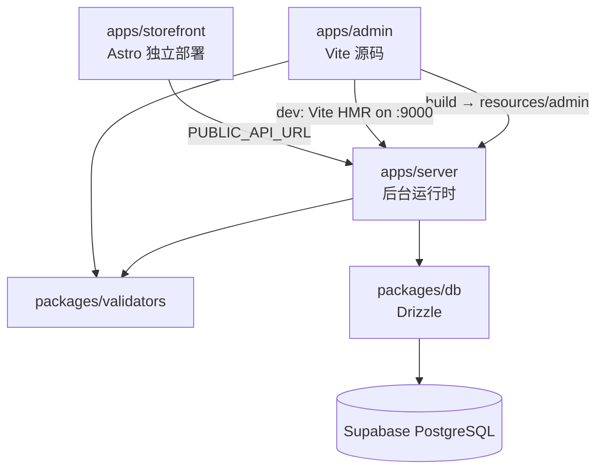

# 功能规格说明 — Hono 全栈架构

> **交接**：外部工具请先读 [`docs/00-agent-handoff.md`](./00-agent-handoff.md) 与根目录 [`AGENT_HANDOFF.md`](../AGENT_HANDOFF.md)。

> 基于 Hono RPC + Drizzle + Vite Admin + Astro Storefront 的自定义电商平台功能规格。
> 复用 Medusa v2.15.3 PostgreSQL 表结构，API 路径与 Medusa 保持兼容（前缀 `/api`）。

---

## 1. 架构总览

> **目标架构（已实施）**：见 [`08-target-architecture.mdx`](./08-target-architecture.mdx) — **`server`** 提供 `/api` + `/app`（`public/app`）；**`storefront` 独立部署**。



| 层级 | 技术 | 职责 |
|------|------|------|
| `apps/server` | Hono + Bun compile / Docker | 后台唯一运行时：`/api` + 生产 `/app` |
| `apps/admin` | Vite + React Router + @medusajs/ui | Admin 源码（build 进 `resources/admin`） |
| `apps/storefront` | Astro（SSG/SSR/hybrid） | C 端，**独立**部署，经 `PUBLIC_API_URL` 调 API |
| `packages/validators` | Zod | 前后端共享请求/表单校验 |
| `packages/db` | Drizzle ORM | 映射 Medusa 表、查询函数 |
| `packages/release` | 打包脚本（可选） | `resources/admin` + 跨平台 `my-store` |

---

## 2. API 路由约定

所有 API 挂载在 `/api` 下，与 Medusa 路径对应关系：

| Hono 路径 | 等价 Medusa | 认证 |
|-----------|-------------|------|
| `POST /api/auth/user/emailpass` | `POST /auth/user/emailpass` | 无 |
| `POST /api/auth/token/refresh` | `POST /auth/token/refresh` | Bearer |
| `GET /api/admin/products` | `GET /admin/products` | Admin JWT |
| `POST /api/admin/products` | `POST /admin/products` | Admin JWT |
| `GET /api/store/products` | `GET /store/products` | Publishable Key（可选） |

**RPC 类型导出**：`apps/server/src/app.ts` 导出 `AppType`，前端 `import type { AppType }` + `hc<AppType>()`.

---

## 3. 模块功能规格

### 3.1 认证模块（Phase 1 — 已实现骨架）

#### 数据表
- `auth_identity` — 认证主体
- `provider_identity` — 邮箱密码（`provider = emailpass`）
- `user` — 管理员用户（通过 `app_metadata.user_id` 关联）

#### Admin API

| 方法 | 路径 | Zod Schema | 响应 |
|------|------|------------|------|
| POST | `/api/auth/user/emailpass` | `loginSchema` | `{ token: string }` |
| POST | `/api/auth/token/refresh` | — | `{ token: string }` |
| GET | `/api/auth/session` | — | `{ user: { id, email, first_name, last_name } }` |

#### 业务规则
1. 查询 `provider_identity` 其中 `entity_id = email` 且 `provider = 'emailpass'`
2. 校验 `provider_metadata.password`（bcrypt）
3. 签发 JWT（`sub` = auth_identity_id，`actor_id` = user_id）
4. Admin 中间件校验 `Authorization: Bearer <token>`

#### Admin 页面
- `/login` — 登录表单（React Hook Form + `loginSchema`）
- 未认证重定向至 `/login`
- Dashboard Shell：侧边栏 + 顶栏

---

### 3.2 商品模块（Phase 2 — 已实现骨架）

#### 数据表
- `product` — 主表
- `product_variant` — SKU
- `product_option` / `product_option_value` — 选项
- `product_image` — 图片

#### Admin API

| 方法 | 路径 | Schema | 说明 |
|------|------|--------|------|
| GET | `/api/admin/products` | `listProductsSchema` | 分页、搜索、状态筛选 |
| GET | `/api/admin/products/:id` | — | 详情含 variants |
| POST | `/api/admin/products` | `createProductSchema` | 创建商品 |
| POST | `/api/admin/products/:id` | `updateProductSchema` | 更新商品 |

#### Store API

| 方法 | 路径 | Schema | 说明 |
|------|------|--------|------|
| GET | `/api/store/products` | `listStoreProductsSchema` | 仅 `published` |
| GET | `/api/store/products/:id` | — | 详情 |

#### 业务规则
1. 列表默认 `deleted_at IS NULL`
2. `handle` 唯一（未删除记录）
3. 创建时默认 `status = draft`，自动生成 `handle`（slug）
4. Store 端仅返回 `status = published`
5. ID 前缀 `prod_`（nanoid）

#### Admin 页面
- `/products` — 商品列表（Data Table）
- `/products/new` — 创建表单
- `/products/:id` — 详情/编辑

#### Storefront 页面
- `/` — 首页商品网格
- `/products/[handle]` — 商品详情

---

### 3.3 订单模块（Phase 3 — 待实现）

#### 数据表
`order`, `order_line_item`, `order_item`, `order_shipping_method`, `order_address`, `order_summary`

#### 核心 API
- `GET /api/admin/orders` — 列表
- `GET /api/admin/orders/:id` — 详情
- `POST /api/admin/orders/:id/fulfillments` — 履约
- `GET /api/store/orders` — 客户订单（需客户 JWT）

#### 工作流
参考 `docs/03-business-workflows.mdx` — cart → order 转换流程

---

### 3.4 购物车 + 结账（Phase 4 — 待实现）

#### 数据表
`cart`, `cart_line_item`, `cart_address`, `cart_shipping_method`

#### Store API
- `POST /api/store/carts`
- `POST /api/store/carts/:id/line-items`
- `POST /api/store/carts/:id/complete`

---

### 3.5 客户模块（Phase 5 — 待实现）

#### 数据表
`customer`, `customer_address`, `customer_group`

---

### 3.6 库存模块（Phase 6 — 待实现）

#### 数据表
`inventory_item`, `inventory_level`, `reservation_item`

---

## 4. 共享 Validators 包

```
packages/validators/src/
├── auth.ts       # loginSchema, refreshSchema
├── product.ts    # list/create/update schemas
├── common.ts     # paginationSchema
└── index.ts
```

前后端用法：
- 后端：`zValidator('json', createProductSchema)`
- 前端：`zodResolver(createProductSchema)`

---

## 5. 多运行时部署

| 入口文件 | 运行时 | 用途 |
|----------|--------|------|
| `entry.bun.ts` | Bun | 本地开发、VPS 生产 |
| `entry.node.ts` | Node.js | 兼容部署 |
| `entry.cf-worker.ts` | Cloudflare Workers | 边缘（需 Hyperdrive） |
| `entry.vercel.ts` | Vercel Edge | Serverless |

生产 All-in-One：见 **`docs/08-target-architecture.mdx`**（单进程 `platform`；C 端保留 Astro 全能力：SSG / SSR / hybrid，由 `STORE_OUTPUT` 决定挂载方式）。当前实现仍为分应用 + 多端口开发，迁移前以现结构为准。

---

## 6. MVP 交付清单

| 优先级 | 模块 | Server | Admin | Store | 状态 |
|--------|------|--------|-------|-------|------|
| P0 | 项目骨架 | ✓ | ✓ | ✓ | 本迭代 |
| P0 | 认证 | ✓ | ✓ | — | 本迭代 |
| P0 | 商品 | ✓ | ✓ | ✓ | 本迭代 |
| P1 | 购物车 | — | — | — | 下一迭代 |
| P1 | 订单 | — | — | — | 下一迭代 |
| P2 | 客户 | — | — | — | 下一迭代 |
| P2 | 支付 | — | — | — | 下一迭代 |

完整 Medusa API 对照见 `docs/02-api-endpoints.mdx` MVP 章节。

---

## 7. Admin UI 复用策略（方案 A — 已定案）

### 7.1 原则

| 目录 | 角色 | 开发时是否启动 | HMR |
|------|------|----------------|-----|
| **`apps/admin`** | 唯一 Admin 开发入口（Vite + React Router） | ✅ `pnpm dev --filter=@my-store/admin` | ✅ Vite HMR |
| **`apps/backend/node_modules/@medusajs/dashboard`** | Medusa 源码参考（仅用于拷贝） | ❌ 不纳入日常链路 | ❌ |

- **禁止**：在 Admin 中 `import` 自外部 dashboard 源码路径（无 alias 联调、不跑 `virtual:medusa/*`）。
- **禁止**：用 `@medusajs/js-sdk`；数据层统一 Hono RPC + TanStack Query。
- **允许**：从 Medusa 源码 **一次性或按需拷贝** 到 `apps/admin/src/`，拷贝后只在 `apps/admin` 内修改。

### 7.2 目录约定

```
apps/admin/src/
  routes/              # 页面（MVP 与新增功能的主战场）
  components/          # 项目自有布局、鉴权等
  hooks/               # use-products、use-auth（Hono RPC）
  lib/api.ts           # hc<AppType>
  dashboard-ui/        # 从 Medusa 源码拷贝的 UI 块，迁入时改写 hooks
```

新功能优先写在 `routes/` + `components/`；从 Medusa 借鉴的块先落 `dashboard-ui/`，接好 RPC 后再视情况并入 `components/`。

### 7.3 拷贝流程

1. 在 `apps/backend/node_modules/@medusajs/dashboard`（或官方仓库 tag）找到目标（如 `components/data-table`）。
2. 执行根目录脚本（或手动复制）到 `apps/admin/src/dashboard-ui/` 或 `apps/admin/src/components/`。
3. 改写：`hooks/api/*` → `apps/admin/src/hooks/use-*.ts`；删除对 `@medusajs/js-sdk` 的引用。
4. 在 `apps/admin` 内 `pnpm dev`，确认 Vite HMR 正常。

```powershell
# 仓库根目录
pnpm run copy:dashboard-ui
```

### 7.4 建议拷贝清单

| 源（Medusa dashboard 源码） | 用途 | 拷贝后必改 |
|------------------------|------|------------|
| `components/data-table/` | 表格 | API hooks |
| `components/table/` | 表格工具 | 少量 |
| `components/layout/` | 布局 | React Router 路径 |
| `components/authentication/` | 登录 UI 参考 | 已用 `routes/login` 可不对接 |
| `providers/` | Query / i18n | 去掉 js-sdk 相关 |
| `i18n/` | 中文文案 | 保留 |
| `hooks/table/` | 表格 hooks | 保留 |

安装依赖：`@medusajs/ui`, `@medusajs/icons`, `@tanstack/react-query`, `react-router-dom`

### 7.5 与单独启动 Medusa Dashboard 的区别

若需对照 Medusa 原版行为，可临时在旧后端环境下单独运行 dashboard（仅对照）。与 `apps/admin` **互不影响**。日常开发只开 `apps/admin` + `apps/server`。

---

## 8. 环境变量

```env
# apps/server
DATABASE_URL=postgresql://...
JWT_SECRET=your-secret-min-32-chars
PORT=9000
NODE_ENV=development

# apps/admin (Vite) — 开发留空走 proxy；直连用 http://localhost:9000（勿加 /api）
VITE_API_URL=

# apps/storefront
PUBLIC_API_URL=http://localhost:9000
```

---

## 9. 开发命令

```bash
pnpm install
pnpm dev                    # 并行启动 server + admin + storefront
pnpm dev --filter=@my-store/server
pnpm build                  # 构建全部
```
