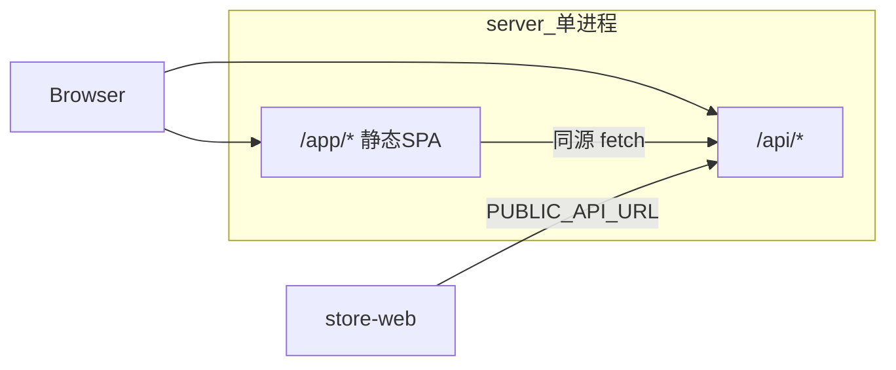

# 目标架构 v3 — Admin 内嵌 Server（/app + /api）

> **状态**：已实施。  
> **API**：仍在 `/api/*`（如 `/api/admin/products`）。  
> **管理界面**：`/app/*`，构建产物在 `apps/server/public/app/`。

---

## 架构



| 项 | 说明 |
|----|------|
| 运行时 | [`apps/server`](../apps/server) |
| Admin 源码 | [`apps/admin`](../apps/admin) |
| 商城 | [`apps/store-web`](../apps/store-web) 独立部署 |

---

## 开发与生产

| 模式 | 命令 | 说明 |
|------|------|------|
| 日常开发 | `pnpm dev` | server + admin Vite + store，**无需 build** |
| 一体联调 | `pnpm dev:admin-on-server` | `build:admin` 后只起 server |
| 生产构建 | `pnpm build:backend` | admin → `public/app` + server typecheck |
| 发行物 | `pnpm build:release` | build:backend + `pnpm compile`（Bun） |

**访问地址**

- API：`http://localhost:9000/api/health`
- Admin（挂载后）：`http://localhost:9000/app/`
- Admin（Vite dev）：`http://localhost:5173/app/`

---

## 环境变量（server）

| 变量 | 说明 |
|------|------|
| `SERVE_ADMIN` | `0` 时仅 API |
| `ADMIN_STATIC_ROOT` | 静态目录，默认 `public/app` |
| `STORE_CORS_ORIGIN` | 商城跨域源，逗号分隔 |
| `CORS_ORIGIN` | 额外允许的 Origin |

---

## Docker

```bash
docker compose -f docker-compose.backend.yml up --build
```

镜像定义：[`apps/server/Dockerfile`](../apps/server/Dockerfile)

---

## 明确不做

- server 内嵌 Vite dev
- 店挂入 server `/*`
- API 去掉 `/api` 前缀
