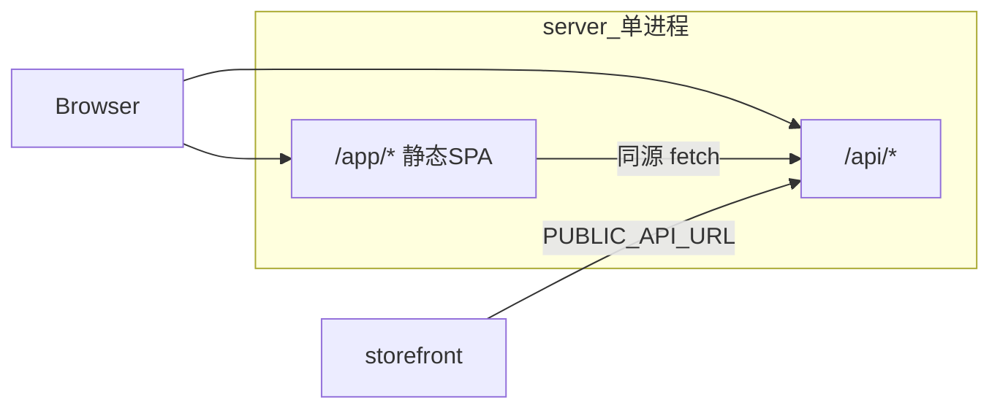

# 目标架构 v3 — Admin 内嵌 Server（/app + /api）

> ⚠️ **参考文档**（部署架构）。**当前状态** → [PROJECT_STATUS.md](./PROJECT_STATUS.md)

> **状态**：已实施。  
> **API**：仍在 `/api/*`（如 `/api/admin/products`）。  
> **管理界面**：`/app/*`，构建产物在 `apps/server/public/app/`。

---

## 架构



| 项 | 说明 |
|----|------|
| 运行时 | [`apps/server`](../apps/server) |
| Admin 源码 | [`apps/admin`](../apps/admin) |
| 商城 | [`apps/storefront`](../apps/storefront) 独立部署 |

---

## 开发与生产

| 模式 | 命令 | 要不要 `build:admin` | 访问 Admin |
|------|------|----------------------|------------|
| 日常开发 | `pnpm dev` | **不要** | `http://localhost:5173/app/`（Vite HMR） |
| 一体联调 / 对齐生产 | `pnpm dev:admin-on-server` | **要**（脚本内会 build） | `http://localhost:7000/app/` |
| 生产 / Docker / 仅起 server | `pnpm build:backend` 后启动 server | **要** | `http://localhost:7000/app/` |

| 脚本 | 说明 |
|------|------|
| `pnpm build:admin` | admin → [`apps/server/public/app`](../apps/server/public/app) |
| `pnpm build:backend` | build:admin + server typecheck |
| `pnpm build:release` | build:backend + `pnpm compile`（需本机 Bun） |

**API 地址（始终）**：`http://localhost:7000/api/*`（与 Admin 用哪个端口无关）

---

## 什么时候必须 build Admin？

**规则**：只有让 **`server` 提供 `/app` 页面** 时才需要先 build；日常改 UI 用独立 Vite，**不 build**。

| 场景 | 是否 build | 原因 |
|------|------------|------|
| `pnpm dev`（三任务，5173 改页面） | 否 | Vite 直接编译 `apps/admin/src`，不经过 `public/app` |
| `pnpm dev:server` 且未 build | `/app` 不可用 | [`mount-app.ts`](../apps/server/src/host/mount-app.ts) 只读磁盘上的 `index.html` + assets |
| `pnpm dev:admin-on-server`、Docker、生产、exe | 是 | 同上，必须由 `vite build` 写出静态文件 |

```text
pnpm build:admin
       ↓
apps/server/public/app/     index.html + assets/
       ↓
mount-app.ts  把  GET /app/*  映射到这些文件
```

**不是 SSR**：server 只发送已 build 好的 HTML/JS（CSR SPA），不在服务端跑 React。

---

## `mount-app.ts` 做什么？

实现文件：[`apps/server/src/host/mount-app.ts`](../apps/server/src/host/mount-app.ts)，在 [`app.ts`](../apps/server/src/app.ts) 里 `/api` 注册之后调用。

| 职责 | 说明 |
|------|------|
| 找目录 | `public/app` 或 `ADMIN_STATIC_ROOT`，存在 `index.html` 才挂载 |
| 路由 | `GET /` → `/app/`；`GET /app/*` → 静态文件；无文件则回退 `index.html`（SPA） |
| 与 API 分离 | `/api/admin/products` 等仍是 Hono 路由，与 `/app` 页面路径无关 |
| 关闭 | `SERVE_ADMIN=0` 时不挂（Worker 等仅 API） |

`/api/health` 响应含 `admin_ui: { mounted, path: "/app" }`，表示静态是否挂上。

---

## 开发：双端口 vs「单端口嵌 Vite」（本仓库选前者）

### 当前做法（已采用）：开发期双端口，生产合一

```text
开发 pnpm dev:
  :7000  server     →  /api/*
  :5173  admin Vite →  /app/*  （源码 + HMR，无需 build）
  :4321  storefront  →  商城（独立）

生产 / 联调:
  :7000  server     →  /api/*  +  /app/*（public/app 静态）
```

### 未采用：开发期单端口 + server 内嵌 Vite

```text
仅 :7000 一个进程
  /api/*  →  Hono
  /app/*  →  Vite middleware 现场编译 admin 源码（开发可不 build）
```

| 对比 | 双端口（现在） | 单端口嵌 Vite（不做） |
|------|----------------|------------------------|
| 日常要不要 build | **不要** | **不要** |
| 生产要不要 build | **要** | **要** |
| 开发 HMR | 官方 Vite，稳 | 需自维护 Hono+Vite 合体 |
| 与线上一致 | 主机不同（5173 vs 7000），路径同为 `/app` | 开发即 7000/app |

**结论**：「Admin 进 server」指的是 **生产（及联调）用 build 产物 + mount-app**；**不等于**开发期每次都要打包，也 **不等于**在 server 里嵌 Vite。

---

## 和「以前架构」差在哪？

| 项 | 以前常见 | 现在 |
|----|----------|------|
| Monorepo | server + admin + storefront | 相同 |
| 开发 | 多端口 | 相同（`pnpm dev`） |
| 生产 Admin | 常单独部署静态或另开端口 | **与 API 同一 server**：`/app` |
| server 职责 | 多半只有 `/api` | `/api` + `/app`（有 build 时） |

日常写页面体验变化不大；变化在 **发布物一个进程、一个端口（7000）带后台 UI**。

---

## 环境变量（server）

| 变量 | 说明 |
|------|------|
| `SERVE_ADMIN` | `0` 时仅 API |
| `ADMIN_STATIC_ROOT` | 静态目录，默认 `public/app` |
| `STORE_CORS_ORIGIN` | 商城跨域源，逗号分隔 |
| `CORS_ORIGIN` | 额外允许的 Origin |

---

## Docker

```bash
docker compose -f docker-compose.backend.yml up --build
```

镜像定义：[`apps/server/Dockerfile`](../apps/server/Dockerfile)

---

## 明确不做

- server 内嵌 Vite dev
- 店挂入 server `/*`
- API 去掉 `/api` 前缀
